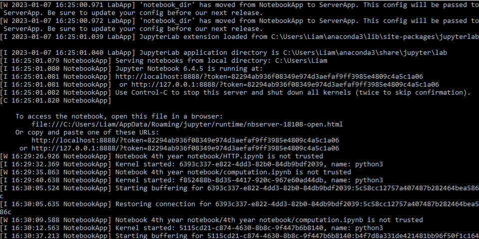
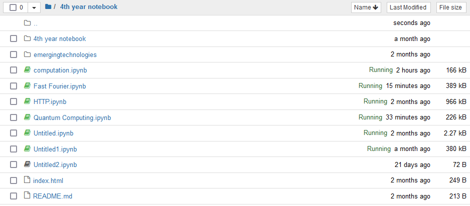

# Emerging-Technology-assessment
The purpose of this README is to explain the importance of HTTPS, Computation, fast fourier and Quantum computing and how to set it up on jupyter.

# Github pages link
https://liamb16.github.io/Emerging-Technology-assessment/

# How to set up on jupyter
Pre Requisites:

•	Download Anaconda 3 at https://www.anaconda.com/products/distribution

•	Download Firefox at https://www.mozilla.org/en-US/firefox/new/

1. create a new folder and open it in the command line
2. Use the command "git clone (repositiory's name)"
3. Move the file you cloned into "c:users/Your name". 
 
4. run jupyter in the background by going to the anaconda3 64bit folder and clicking "Jupyter Notebook". You should see this command line appear as shown below.
  
5. FireFox will automatically open and you should see this page shown below
 
  
#  HTTP
  In this section,
  * Learn what HTTP is.
  * Learn what the difference is between HTTP and HTTPS.
  * Learn what are the HTTP status codes.
  * Learn what are DDOS attacks
  
# Computation
  In this section,
   * show code to demonstrate these ideas.
   * Learn about Big 0 notation.
   * Learn what a turing machine is.
   * Learn how a turing machine is related to a quantum computer.
   * 
# Fast Fourier
  In this section,
  * Learn what are compllex numbers
  * Learn What is Fast Fourier Transform
  * show code to demonstrate these ideas.
# Quantum Computing
In this section,
  * Learn what quantum computing is.
  * Learn what the Deutsch Algorithm.
  * Learn the difference between traditional computing and quantum computing.
  * show code to demonstrate these ideas.
  
  
 
